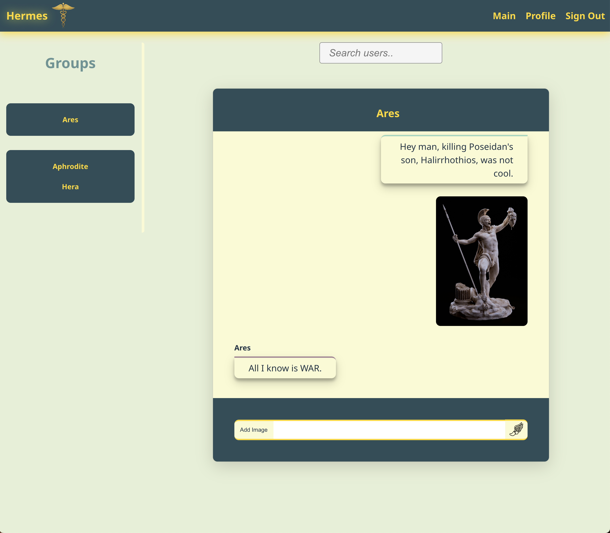
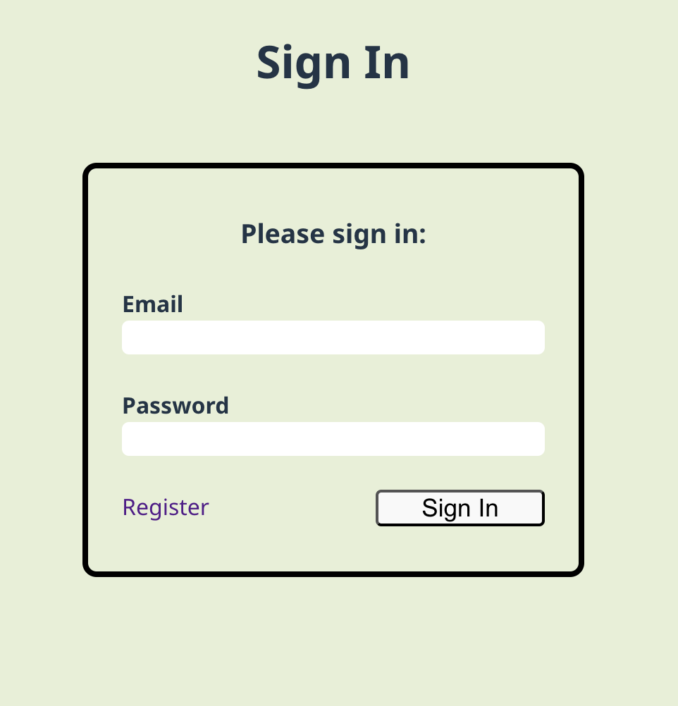
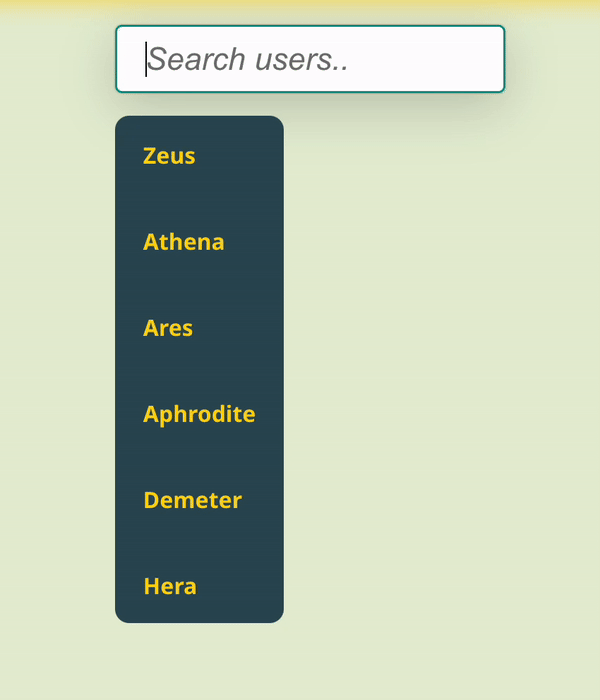
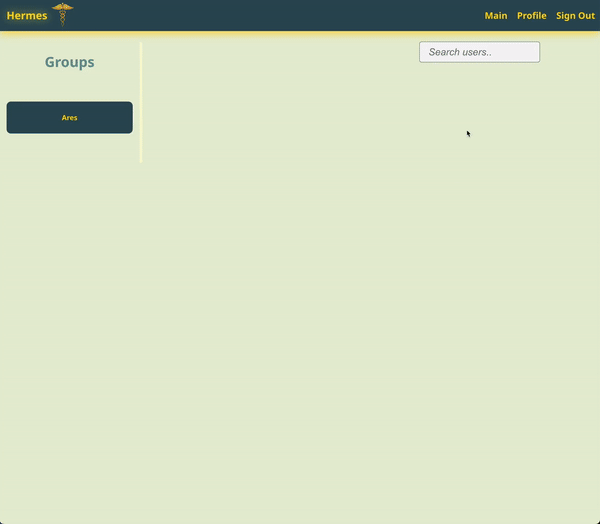
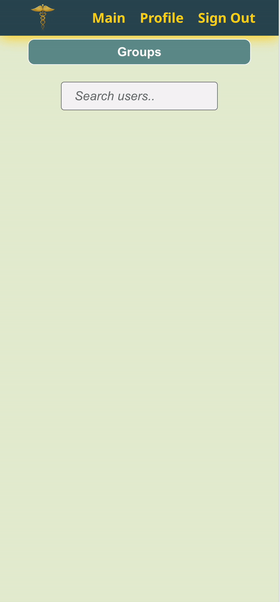
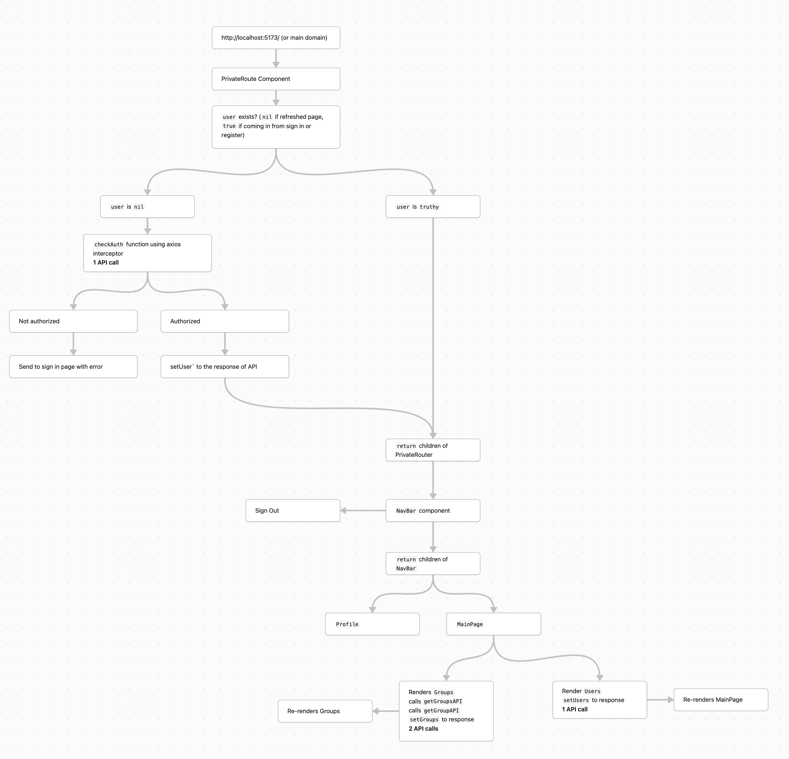
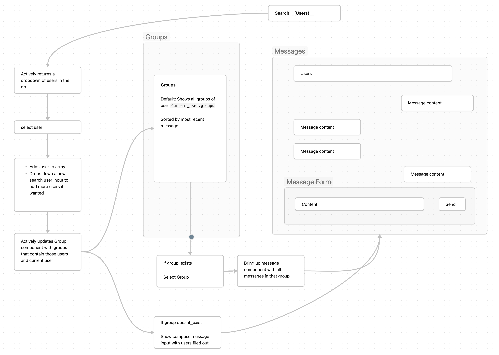

 

  
<h3 align="center">Hermes Messenger</h3>

  

    A messaging app with token authentication built with Rails and React to send and receive messages to users.
     
     
    <a href="https://github.com/PhilipTimofeyev/messaging_app"><strong>Explore the docs »</strong></a>
     
     
    <a href="https://hermes-messenger.netlify.app">View Demo</a>
    ·
      <a href="https://github.com/PhilipTimofeyev/messaging-app-api">Link to Backend API</a>
    .
    <a href="https://github.com/PhilipTimofeyev/messaging_app/issues/new?labels=bug&template=bug-report---.md">Report Bug</a>
    ·
    <a href="https://github.com/PhilipTimofeyev/messaging_app/issues/new?labels=enhancement&template=feature-request---.md">Request Feature</a>
  

<!-- TABLE OF CONTENTS -->

  
Table of Contents

  <ol>
    <li>
      <a href="#about-the-project">About The Project</a>
      <ul>
        <li><a href="#built-with">Built With</a></li>
      </ul>
    </li>
    <li><a href="#usage">Usage</a></li>
    <li><a href="#roadmap">Roadmap</a></li>
    <li><a href="#contributing">Contributing</a></li>
    <li><a href="#license">License</a></li>
    <li><a href="#contact">Contact</a></li>
    <li><a href="#acknowledgments">Acknowledgments</a></li>
  </ol>

<!-- ABOUT THE PROJECT -->

## About The Project

Hermes Messenger is a messaging app where users can register an account and sign in to send messages to other users. The app uses token authentication on the Rails backend to create and verify tokens, which are stored on the user's machine until they expire or the user signs out. This allows users to refresh their browser or close the tab without needing to sign in every time.

 Users are able to send text as well as images, which are stored using Amazon's S3.

(<a href="#readme-top">back to top</a>)

### Built With

**Backend:**

- Ruby on Rails
- PostgreSQL
- Devise/ Devise API
- AWS
- Heroku

**Frontend:**

- React
- React Router
- Vite
- Axios
- Javascript
- Netlify
- Vanilla HTML/CSS

(<a href="#readme-top">back to top</a>)

<!-- USAGE EXAMPLES -->
## Usage

Upon loading of the site, users are met with a sign in form. If the user have an account, they may sign in to access the site, or click the *Register* link to create an account. 

Errors are displayed if any issues exist upon registration or signin. 

Once the user is signed in, they are permitted to the main part of the app which contains the user's groups, which are messages between them and other user(s). 

Here, user can either select one of the groups to check or write new messages, or they can create a new message.

To create a new message, the selects the *Search* bar at the top, which brings down a dropdown of all of the registered users. The user can either select a user from the dropdown, or type a name which actively updates the user list. 

When the user selects a name, it gets added to a working list of whom the user will be messaging. If the user already has message the user(s), that group will be pulled up and shown. To remove another user from the message, the user can click the name of the unwanted user and they are removed. If this is their first message between the selected user(s), then a new group is automatically created when a message is sent. 

Images may be sent along with text, which are stored using Amazon's S3 service.

##### Responsive Design

Designed to be responsive, switching groups to a dropdown menu when on mobile.

### Authentication

The Rails backend uses the Devise and Devise API gems to maintain users, and provision token authentication. 

When a visits the site, the `checkAuth()` function is called which uses Axios to check if the user has a valid token. This is done by an Axios interceptor, which retrieves the access token from local storage if available. If the token is available and valid, the user is permitted to see their main page. 

If the user is not permitted, they are redirected to the sign in page via react router. Once the user either registers or signs in, the Rails API sends the frontend an access and refresh token to use for authentication. 

This diagram shows the logical progression of when the app load:

#### Groups

The logic for how a group is selected or created can be seen in the following diagram:

(<a href="#readme-top">back to top</a>)

<!-- ROADMAP -->

## Future Features

- Setting up Rails action cable for instant updates of messages sent and received.
- Using Action Mailer to send account creation and recovery emails.
- Updating the UI to use component libraries like Charkra UI.

See the [open issues](https://github.com/PhilipTimofeyev/messaging_app/issues) for a full list of proposed features (and known issues).

(<a href="#readme-top">back to top</a>)

<!-- CONTRIBUTING -->
## Contributing

Contributions are what make the open source community such an amazing place to learn, inspire, and create. Any contributions you make are **greatly appreciated**.

If you have a suggestion that would make this better, please fork the repo and create a pull request. You can also simply open an issue with the tag "enhancement".
Don't forget to give the project a star! Thanks again!

1. Fork the Project
2. Create your Feature Branch (`git checkout -b feature/AmazingFeature`)
3. Commit your Changes (`git commit -m 'Add some AmazingFeature'`)
4. Push to the Branch (`git push origin feature/AmazingFeature`)
5. Open a Pull Request

(<a href="#readme-top">back to top</a>)

<!-- LICENSE -->
## License

Distributed under the MIT License. See `LICENSE.txt` for more information.

(<a href="#readme-top">back to top</a>)

<!-- CONTACT -->

## Contact

Your Name - philiptimofeyev@gmail.com

Project Link: [https://github.com/PhilipTimofeyev/messaging_app](https://github.com/PhilipTimofeyev/messaging_app)

(<a href="#readme-top">back to top</a>)

<!-- ACKNOWLEDGMENTS -->
## Acknowledgments

* [README Template](https://github.com/banesullivan/README)
* [Skill Icons](https://github.com/tandpfun/skill-icons?tab=readme-ov-file#example)
* Images from https://www.freepik.com/

(<a href="#readme-top">back to top</a>)

